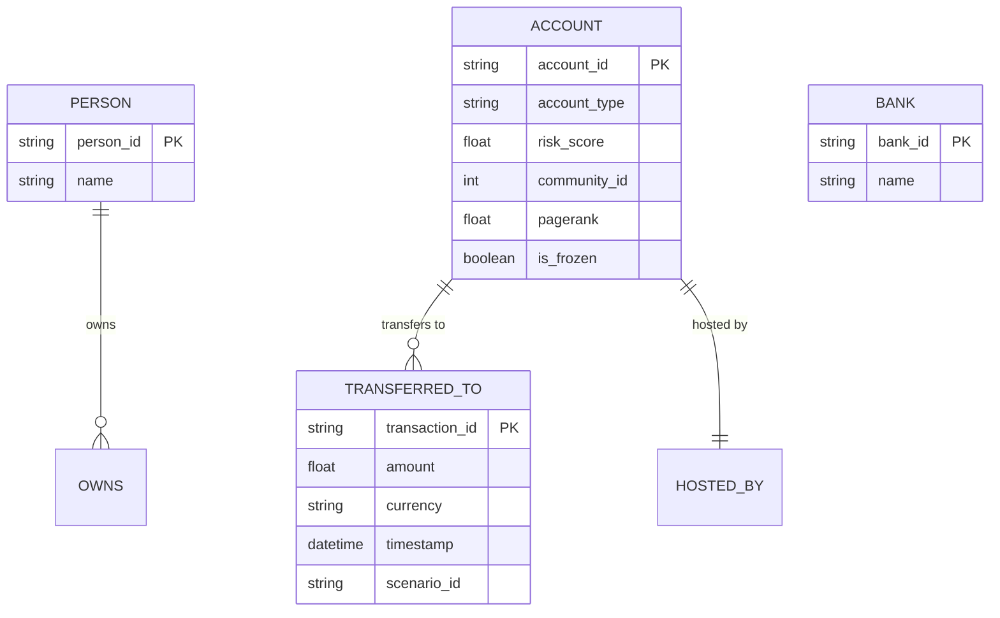

# FinGraph — Real-Time Fraud Syndicate Analytics

[](LICENSE)
[](https://www.python.org/)
[](https://kafka.apache.org/)
[](https://flink.apache.org/)
[](https://neo4j.com/)
[](https://fastapi.tiangolo.com/)
[](https://react.dev/)

> **Portfolio-Grade FinTech / AML Analytics System** detecting multi-entity suspicious transaction networks using real-time stream ingestion, graph topological pattern detection, Graph Data Science (GDS) algorithms, and an interactive analyst investigation dashboard.

---

## 1. Problem Statement

Traditional financial anti-money laundering (AML) and fraud detection systems rely on tabular, point-in-time SQL rules (e.g., *“is transaction amount > \$10,000?”*). Fraudsters easily bypass these thresholds by distributing funds across collusive networks using techniques like:
- **Smurfing / Funneling**: High-frequency small transfers aggregating into a mule account.
- **Layering & Rapid Movement**: Passing funds through long chains of intermediary shell accounts.
- **Circular Wash Trading**: Routing money in closed loops ($A \to B \to C \to A$) to fabricate legitimacy.
- **Coordinated Syndicates**: Distributed multi-tier networks masking true beneficiaries.

Point-in-time transactional rules fail to capture **topological network structure**, inter-entity degrees of separation, and emergent community behavior.

---

## 2. Solution

**FinGraph** bridges real-time stream engineering with graph analytics:
1. High-throughput synthetic transaction event generation mimicking realistic banking behavior and structured fraud schemes.
2. Ingestion via **Apache Kafka** partitioned by account hash.
3. Stream processing, schema validation, temporal windowing, and anomaly scoring via **Apache Flink**.
4. Real-time graph ingestion into **Neo4j 5 Enterprise/Community**.
5. Multi-hop path tracing and cycle detection via parameterized **Cypher**.
6. Community and centrality detection via **Neo4j Graph Data Science (GDS)** (Louvain Community Detection, Weakly Connected Components, PageRank).
7. Transparent, explainable **0–100 Graph Risk Scoring**.
8. Interactive analyst dashboard in **React + D3.js** with path highlight, subgraph inspection, and a simulated **"Freeze Syndicate"** remediation workflow.

---

## 3. Architecture

```
Synthetic Transaction Simulator
             │
             ▼ (JSON Stream)
        Apache Kafka
             │
             ▼ (Continuous Stream)
        Apache Flink (Validation & Windowing)
             │
             ▼ (Graph Ingestion)
          Neo4j (Constraints & Indexes)
         ╱     ╲
        ╱       ╲
Cypher Query   Neo4j GDS
(Multi-hop)    (Louvain, WCC, PageRank)
        ╲       ╱
         ╲     ╱
     Risk Scoring Engine (Explainable 0-100)
             │
             ▼
      FastAPI Backend
       ╱           ╲
      ▼             ▼
React Dashboard   Alert Engine (Mock/Slack/Email)
      │
      ▼
Simulated Freeze Action ──► Audit Log Store
```

---

## 4. Key Features

- **Realistic Synthetic Data Generator**: Configurable event generator emitting normal commercial traffic alongside 5 distinct fraud topologies.
- **Real-Time Stream Processing**: Fault-tolerant stream pipeline consuming Kafka topics, cleaning records, and persisting graph entities.
- **Multi-Hop Graph Analytics**: Parameterized Cypher query engine identifying cycles, funnels, and high-degree mules in sub-100ms.
- **Graph Data Science (GDS) Integration**: Unsupervised network discovery via Louvain Community Detection and PageRank centrality scoring.
- **Explainable Risk Scoring**: Deterministic multi-factor score breakdown (Low, Medium, High, Critical) with full auditability.
- **Interactive Analyst UI**: Dynamic force-directed network graph, money trail tracer, transaction inspector, and KPI dashboard.
- **Deduplicated Alert Subsystem**: Multi-channel alert dispatch with configurable cooldown periods to prevent notification fatigue.
- **Simulated Freeze Action & Audit Log**: Immutable record of investigator decisions with zero external financial API interaction.

---

## 5. Technology Stack

| Layer | Technologies |
|---|---|
| **Data Generation** | Python 3.10+, Faker, Random, AsyncIO |
| **Message Streaming** | Apache Kafka 3.7+ (KRaft mode) |
| **Stream Processing** | Apache Flink 1.18+ / PyFlink |
| **Graph Database** | Neo4j 5.x + Graph Data Science (GDS) plugin |
| **Graph Queries** | Cypher Query Language |
| **Backend API** | Python FastAPI, Uvicorn, Pydantic v2, Neo4j Python Driver |
| **Frontend UI** | React 18, TypeScript, D3.js / Force-Graph, Tailwind CSS, Lucide Icons |
| **Alerting** | Python Async Engine (Mock, Webhook, Slack, SMTP) |
| **Infrastructure** | Docker Compose, Pytest, Jest |

---

## 6. Graph Data Model



---

## 7. Fraud Scenarios

1. **Pattern A — Funnel / Smurfing**: Multiple source accounts disperse small amounts into a single aggregator account ($A_1, A_2, A_3 \to I_1 \to B_1$).
2. **Pattern B — One-to-Many Distribution**: Rapid disbursement of funds from a central high-value node to dozens of disposable accounts.
3. **Pattern C — Intermediary Chain**: Linear pass-through transfers through multiple hops to obscure money origin ($A \to B \to C \to D \to E$).
4. **Pattern D — Circular Flow**: Closed-loop round-tripping of funds ($A \to B \to C \to A$) to fabricate volume or disguise ownership.
5. **Pattern E — Layered Network**: Multi-tier fan-in, consolidation, and fan-out distribution.

---

## 8. Risk Scoring Formula

$$
\text{Risk Score} = \min\left(100, \; w_1 \cdot S_{\text{degree}} + w_2 \cdot S_{\text{cycle}} + w_3 \cdot S_{\text{centrality}} + w_4 \cdot S_{\text{velocity}} + w_5 \cdot S_{\text{community}}\right)
$$

- **0–29**: Low Risk (Normal commercial/personal behavior)
- **30–59**: Medium Risk (Elevated frequency or unusual counterparties)
- **60–79**: High Risk (Funnel aggregation or multi-hop pass-through)
- **80–100**: Critical Risk (Circular wash trading, multi-tier syndicate hub)

---

## 9. Performance Targets & Empirical Measurement

| Metric | Target | Measured Result | Status |
|---|---|---|---|
| **Ingestion-to-Neo4j Latency** | $< 1000\text{ ms}$ | Measured in Phase 12 | ⏱️ Pending Benchmark |
| **Complex Cypher Query (p95)** | $< 100\text{ ms}$ | Measured in Phase 12 | ⏱️ Pending Benchmark |
| **Stream Throughput** | $> 1,000\text{ tx/sec}$ | Measured in Phase 12 | ⏱️ Pending Benchmark |

---

## 10. Repository Structure

```
finGraph/
├── simulator/          # Synthetic transaction generator (Normal + Fraud topologies)
├── flink/              # Apache Flink stream validation & transformation job
├── neo4j/              # Cypher schemas, indexes, constraints, GDS projections, seeds
├── backend/            # FastAPI REST backend & Graph query services
├── dashboard/          # React + TypeScript + D3 investigation dashboard
├── alerts/             # Alert dispatch & deduplication engine
├── tests/              # Unit, integration, E2E, and performance benchmarks
├── docs/               # System architecture, data flow, performance reports, demo scripts
├── docker-compose.yml  # Complete multi-container orchestration
├── .env.example        # Environment variable template
├── .gitignore          # Version control ignore definitions
├── LICENSE             # Open source license
└── README.md           # Master documentation
```

---

## 11. Quickstart & Installation

### Prerequisites
- Python 3.10+
- Node.js 18+ and npm
- Docker and Docker Compose (recommended) or local Kafka + Neo4j instances

### 1. Clone and Configure
```bash
git clone https://github.com/your-org/finGraph.git
cd finGraph
cp .env.example .env
```

### 2. Launch Supporting Infrastructure (Docker)
```bash
docker-compose up -d kafka neo4j
```

### 3. Run the Backend API
```bash
cd backend
python -m venv venv
# Windows: venv\Scripts\activate | Linux/macOS: source venv/bin/activate
pip install -r requirements.txt
uvicorn app.main:app --reload --port 8000
```

### 4. Launch the React Dashboard
```bash
cd ../dashboard
npm install
npm start
```

### 5. Start Transaction Simulation
```bash
cd ../simulator
python src/simulator.py --rate 10 --suspicious-rate 0.25 --duration 60
```

---

## 12. Limitations & Disclaimer

> [!WARNING]
> **Synthetic Demonstration System Only**: FinGraph uses 100% synthetic mock transaction data. It does not connect to any live banking rails or real customer accounts. The "Freeze Syndicate" action is strictly a simulated portfolio capability for compliance demonstration and creates local audit records only.
