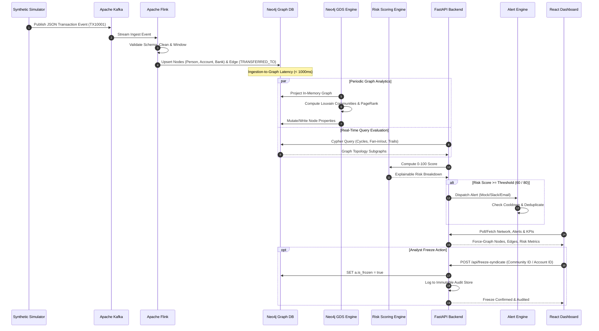

# FinGraph Data Flow & Pipeline Mechanics

## 1. End-to-End Life of a Transaction Event

```mermaid
sequenceDiagram
    autonumber
    participant Sim as Synthetic Simulator
    participant Kafka as Apache Kafka
    participant Flink as Apache Flink
    participant Neo4j as Neo4j Graph DB
    participant GDS as Neo4j GDS Engine
    participant Risk as Risk Scoring Engine
    participant API as FastAPI Backend
    participant Alert as Alert Engine
    participant UI as React Dashboard

    Sim->>Kafka: Publish JSON Transaction Event (TX10001)
    Kafka->>Flink: Stream Ingest Event
    Flink->>Flink: Validate Schema, Clean & Window
    Flink->>Neo4j: Upsert Nodes (Person, Account, Bank) & Edge (TRANSFERRED_TO)
    Note over Neo4j: Ingestion-to-Graph Latency (< 1000ms)
    
    par Periodic Graph Analytics
        GDS->>Neo4j: Project In-Memory Graph
        GDS->>GDS: Compute Louvain Communities & PageRank
        GDS->>Neo4j: Mutate/Write Node Properties
    and Real-Time Query Evaluation
        API->>Neo4j: Cypher Query (Cycles, Fan-in/out, Trails)
        Neo4j-->>API: Graph Topology Subgraphs
    end

    API->>Risk: Compute 0-100 Score
    Risk-->>API: Explainable Risk Breakdown

    alt Risk Score >= Threshold (60 / 80)
        API->>Alert: Dispatch Alert (Mock/Slack/Email)
        Alert->>Alert: Check Cooldown & Deduplicate
    end

    UI->>API: Poll/Fetch Network, Alerts & KPIs
    API-->>UI: Force-Graph Nodes, Edges, Risk Metrics

    opt Analyst Freeze Action
        UI->>API: POST /api/freeze-syndicate (Community ID / Account ID)
        API->>Neo4j: SET a.is_frozen = true
        API->>API: Log to Immutable Audit Store
        API-->>UI: Freeze Confirmed & Audited
    end
```
