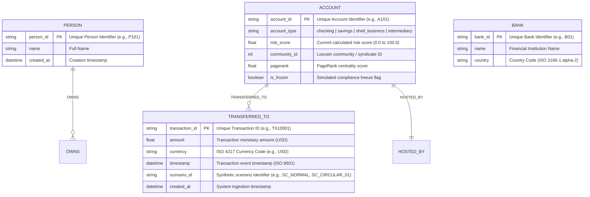

# FinGraph Data Model Specification

## 1. Graph Schema Overview

FinGraph represents financial entities as nodes and interactions as directed edges within Neo4j.



## 2. Event Payload Schema (JSON)

Every transaction emitted over Kafka and processed by Flink adheres to:

```json
{
  "$schema": "http://json-schema.org/draft-07/schema#",
  "title": "FinGraphTransactionEvent",
  "type": "object",
  "properties": {
    "transaction_id": { "type": "string", "pattern": "^TX[0-9A-Za-z_-]+$" },
    "timestamp": { "type": "string", "format": "date-time" },
    "from_account": { "type": "string", "minLength": 2 },
    "to_account": { "type": "string", "minLength": 2 },
    "amount": { "type": "number", "minimum": 0.01 },
    "currency": { "type": "string", "minLength": 3, "maxLength": 3 },
    "from_person": { "type": "string" },
    "to_person": { "type": "string" },
    "bank": { "type": "string" },
    "transaction_type": { "type": "string" },
    "scenario_id": { "type": "string" },
    "is_synthetic": { "type": "boolean", "default": true }
  },
  "required": [
    "transaction_id",
    "timestamp",
    "from_account",
    "to_account",
    "amount",
    "currency",
    "from_person",
    "to_person",
    "bank"
  ]
}
```
